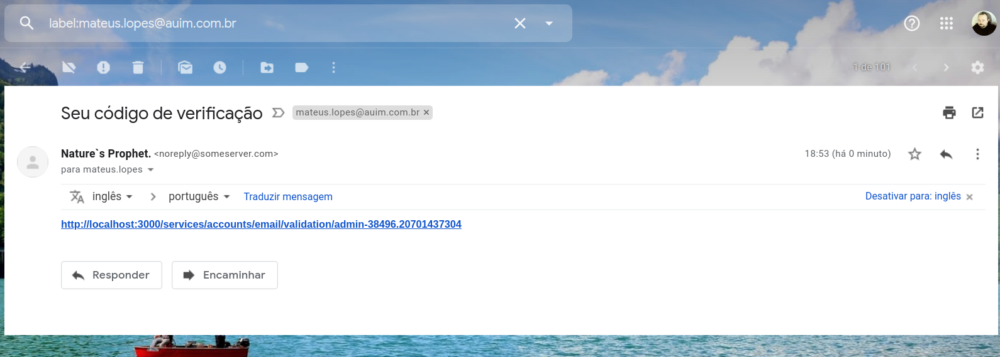
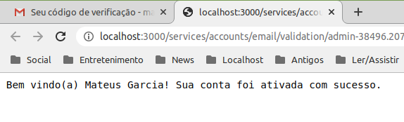
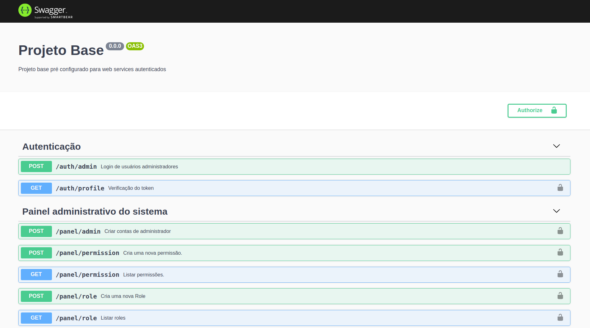
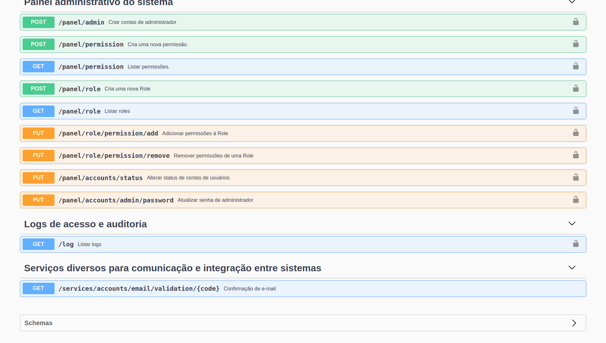
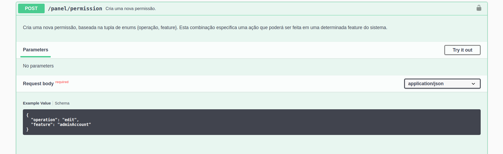
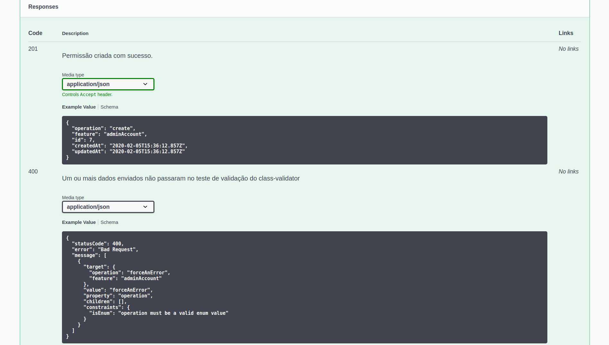
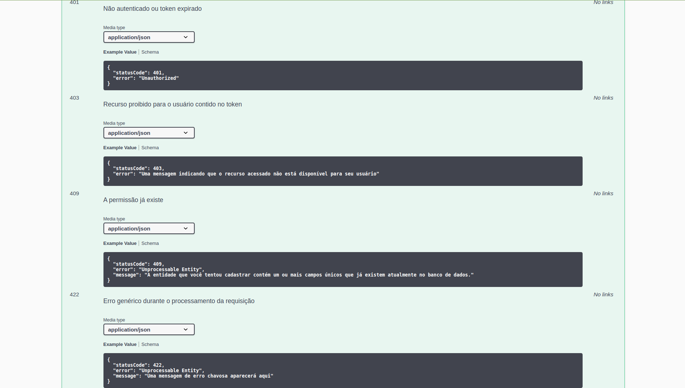
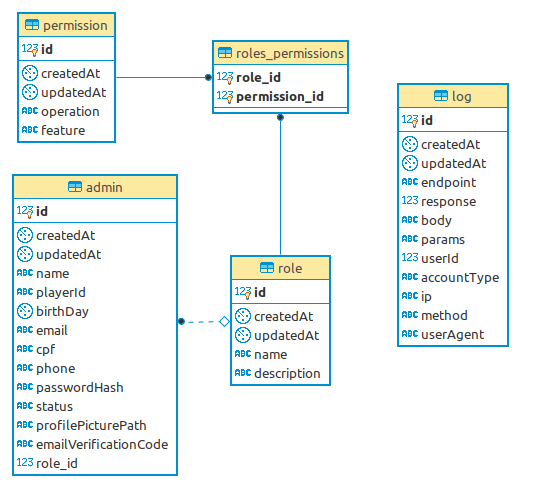

<p align="center">
  <a href="http://nestjs.com/" target="blank"></a>
</p>
<p align="center">
   Uma aplicação desenvolvida em <a href="https://github.com/Microsoft/TypeScript">Typescript</a> usando <a href="http://nestjs.com/">Nestjs Framework</a>
</p>

# Autenticação com JWT e Passport
[](http://commitizen.github.io/cz-cli/)[](https://conventionalcommits.org)

Sistema base pré-ajustado para começar projetos incríveis com autenticação profissional. Basta clonar o repositório e começar novos projetos com o código base já pronto!

## Painel Administrativo
Um painel administrativo pré configurado e pronto para iniciar novos projetos, dando acesso à dados sensíveis do sistema apenas para administradores com permissões válidas para cada operação específica

## Permissões e grupos
Contas de administrador possuem uma role, que é formada por uma agregação de várias permissões, que definem quais recursos a conta poderá acessar dentro do sistema

## Configuração do ambiente
Crie um arquivo .env baseado no .env.example disponível na raíz do projeto.

Suba um banco de dados Postgre. Você pode usar o script do package.json pronto para a tarefa usando o Docker:
```
npm run postgre:test
```


## Iniciando a API em ambiente de desenvolvimento
```
npm start
```

## Debug
Após iniciar o Debug (F5), aguarde a mensagem "API pronta e ouvindo na porta 3000" no terminal do debugger antes de iniciar a sua depuração.

## Ativação de contas de usuário
As contas de usuário entram no sistema como pendentes ao serem cadastradas, o que não permite o login. Se as configurações de ambiente (.env) estiverem com os dados de email corretamente configurados, o sistema enviará um email de confirmação para o email do usuário, e ao clicar no link, a conta é ativada e o usuário poderá se logar.





## Documentação dos endpoints

A API foi documentada com o novo Swagger 4, facilitando ao máximo a vida do time de front-end. para consultar a documentação, basta subir a api e acessar a rota raiz.




Para consultar a documentação de uma rota, basta clicar nela, expandindo seus dados:






## Banco de dados

